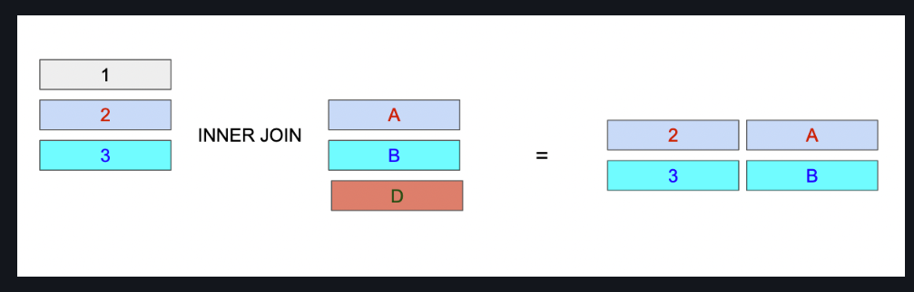

--Aula 4

alter table palcos rename column id to id_palco;

select * from bandas, palcos;

select id_palco from bandas, palcos;

select p.* from palcos as p;

select * from bandas b;

select b.id_palco, p.id_palco from bandas b, palcos as p;

delete from bandas where in (4,5);

select p.nome_palco, b.nome from bandas b, palcos as p;

-- inner JOIN => retorna as linhas em que há pelo menos uma correspondência,
-- em ambas as tabelas conectadas;

select bandas.nome, palcos.nome_palco, shows."data" 

from shows;

inner join bandas on shows.id_banda --(chave estrangeira) = bandas.id --(id local)

INNER JOIN Palcos ON Shows.Id_Palco = Palcos.id_palco ;

------------------------------------

# JOINS

#### O JOIN é uma operação utilizada em bancos de dados relacionais para combinar dados de duas ou mais tabelas com base em uma ou mais colunas em comum. A utilização de joins permite que informações de diferentes tabelas sejam combinadas em uma única consulta, tornando possível a realização de consultas mais complexas e sofisticadas.

#### Existem vários tipos de JOIN disponíveis em SQL, sendo os mais comuns:

## INNER JOIN
O INNER JOIN retorna apenas os registros que possuem correspondência nas duas tabelas envolvidas. Em outras palavras, o INNER JOIN retorna apenas as linhas onde há uma correspondência entre as chaves primárias e estrangeiras das tabelas.

Suponha que temos duas tabelas "Pedidos" e "Clientes", e queremos encontrar todos os pedidos feitos pelos clientes da cidade de São Paulo:

    SELECT  p.Pedido,
            c.Nome
        FROM Pedidos p
            INNER JOIN Clientes c 
                ON p.ClienteID = c.ClienteID
        WHERE c.Cidade = 'São Paulo';

Outro exemplo:

Table A has four rows: (1,2,3,4) and table B has four rows: (3,4,5,6)

When table A joins with table B using the inner join, you have the result set (3,4) that is the intersection of table A and table B.

For each row in table A, the inner join clause finds the matching rows in table B. If a row is matched, it is included in the final result set.

Suppose the columns in the A and B tables are a and b. The following statement illustrates the inner join clause:

    SELECT a
    FROM A
    INNER JOIN B ON b = a;

The INNER JOIN clause appears after the FROM clause. The condition to match between table A and table B is specified after the ON keyword. This condition is called join condition i.e., B.n = A.n

**The INNER JOIN clause can join three or more tables as long as they have relationships, typically foreign key relationships.**

For example, the following statement illustrates how to join 3 tables: A, B, and C:

    SELECT
    A.n
    FROM A
    INNER JOIN B ON B.n = A.n
    INNER JOIN C ON C.n = A.n;

## SQL INNER JOIN examples

### 1) Using SQL INNER JOIN to join two tables example

We will use the employees and departments tables from the sample database to demonstrate how the INNER JOIN clause works.

Each employee belongs to one and only one department while each department can have more than one employee. The relationship between the departments and employees is one-to-many.

The department_id column in the employees table is the foreign key column that links the employees to the departments table.

To get the information of the department id 1,2, and 3, you use the following statement.

    SELECT
        department_id,
        department_name
    FROM
        departments
    WHERE
        department_id IN (1, 2, 3);

Notice that we used the IN operator in the WHERE clause to get rows with department_id 1, 2 and 3.

To get the information of employees who work in the department id 1, 2 and 3, you use the following query:

    SELECT
        first_name,
        last_name,
        department_id
    FROM
        employees
    WHERE
        department_id IN (1, 2, 3)
    ORDER BY
        department_id;

To combine data from these two tables, you use an inner join clause as the following query:

    SELECT 
        first_name,
        last_name,
        employees.department_id,
        departments.department_id,
        department_name
    FROM
        employees
            INNER JOIN
        departments ON departments.department_id = employees.department_id
    WHERE
        employees.department_id IN (1 , 2, 3);

For each row in the employees table, the statement checks if the value of the department_id column equals the value of the department_id column in the departments table. If the condition

If the condition employees.department_id = departments.department_id 

is satisfied, the combined row that includes data from rows in both employees and departments tables are included in the result set.

Notice that both employees and departments tables have the same column name department_id, therefore we had to qualify the department_id column using the syntax table_name.column_name.

### 2) SQL INNER JOIN 3 tables example
Each employee holds one job while a job may be held by many employees. The relationship between the jobs table and the employees table is one-to-many.

The following database diagram illustrates the relationships between employees, departments and jobs tables:

The following query uses the inner join clauses to join 3 tables: employees, departments, and jobs to get the first name, last name, job title, and department name of employees who work in department id 1, 2, and 3.

    SELECT
        first_name,
        last_name,
        job_title,
        department_name
    FROM
        employees e
    INNER JOIN departments d ON d.department_id = e.department_id
    INNER JOIN jobs j ON j.job_id = e.job_id
    WHERE
        e.department_id IN (1, 2, 3);

