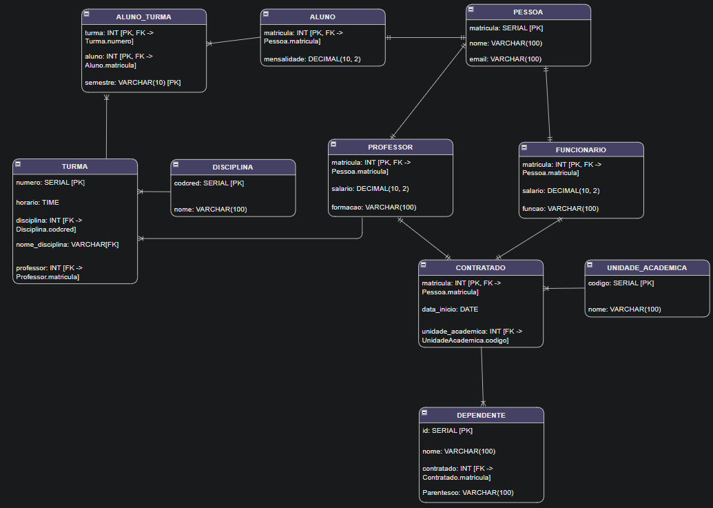

# Projeto da Hierarquia de Pessoas da Universidade

Este projeto consiste na modelagem de um banco de dados para representar a hierarquia de uma universidade, incluindo alunos, professores, funcionários, turmas, disciplinas e unidades acadêmicas. O objetivo é fornecer uma estrutura de dados robusta e flexível que possa ser utilizada para gerenciar as informações da universidade de forma eficaz.

## Enunciado
Considere as Pessoas que têm relacionamento com a universidade.

Alunos possuem um número de matrícula, nome e e-mail, além de um valor de mensalidade. Eles se matriculam em Turmas em um determinado semestre, sendo que não é possível um mesmo aluno matricular-se na mesma turma no mesmo semestre.

Os Professores possuem número de matrícula, nome, e-mail, salário e uma formação, ensinando para várias Turmas. Cada Turma é identificada por um número e pelo codcred da disciplina, possuindo, ainda, o nome da disciplina e o horário.

Já os Funcionários têm número de matrícula, nome, e-mail, salário e uma função.

Todos os Contratados da universidade, incluindo Professores e Funcionários, atuam em uma Unidade Acadêmica, que possui um código e um nome, sendo registrada a data de início na Unidade.

Além disso, os Contratados podem declarar seus dependentes, sendo que cada dependente pode estar associado no máximo a um Contratado.

## Estrutura do Banco de Dados
O banco de dados é composto pelas seguintes tabelas:

- `Pessoa`: Armazenar informações comuns a todos os indivíduos, como matricula, nome e email. Boa prática para evitar a duplicação de dados.

- As tabelas `Aluno`, `Professor` e `Funcionario` herdam de Pessoa através de uma chave estrangeira que referencia matricula. Além disso, essas tabelas armazenam dados específicos para cada tipo de pessoa, como mensalidade (aluno), salário (prof e funcionário), formação (prof) e função (funcionário).

- `UnidadeAcademica`: Representa as unidades acadêmicas da universidade, como faculdades ou departamentos.

- `Contratado`: Representa tanto Professor quanto Funcionario, pois ambos são contratados pela universidade, tendo uma data_inicio e uma unidade_academica associada.

- `Dependente`: Tabela associada a Contratado através de uma chave estrangeira. Isso garante que cada dependente esteja associado a no máximo um contratado. 

- `Disciplina`: Contém informações sobre as disciplinas oferecidas pela universidade.

- `Turma`: Tabela associada a Disciplina e Professor. Permite que você saiba qual professor está ensinando qual disciplina em qual turma, além do horário.

- `Aluno_Turma`: Associa Aluno a Turma e inclui o semestre. A chave primária é uma combinação de aluno, turma e semestre, o que impede que um aluno se matricule na mesma turma no mesmo semestre, conforme exigido pelo enunciado.

## DER (Diagrama Entidade e Relacionamento)

## Como Usar
- Configuração do Banco de Dados: O banco de dados pode ser criado a partir dos scripts fornecidos neste repositório. Certifique-se de configurar corretamente o ambiente de banco de dados de acordo com as instruções específicas do seu sistema.

- População do Banco de Dados: Utilize os scripts de inserção de dados fornecidos para popular o banco de dados com informações fictícias de alunos, professores, funcionários, turmas, etc.

- Execução de Consultas: Explore as consultas SQL disponíveis para recuperar informações específicas do banco de dados de acordo com as necessidades do projeto

## Consultas e Operações
O banco de dados suporta uma variedade de consultas e operações, incluindo:

- Cadastro e gerenciamento de alunos, professores e funcionários.

- Matrícula de alunos em turmas.

- Registro de dependência entre contratados e seus dependentes.

- Associação de professores e funcionários às unidades acadêmicas.

- Registro de turmas e atribuição de professores a elas.

- Consultas para recuperar informações sobre alunos, professores, funcionários, turmas e disciplinas.

## Tecnologias usadas:
- [Draw.io](https://app.diagrams.net/);
- [DBeaver 24.0.3](https://dbeaver.io/download/);
- [Postgre 16.2](https://www.postgresql.org/).

## Contribuições
Se você tiver sugestões de melhorias, correções ou novos recursos para adicionar ao projeto, sinta-se à vontade para abrir uma issue ou enviar um pull request.
